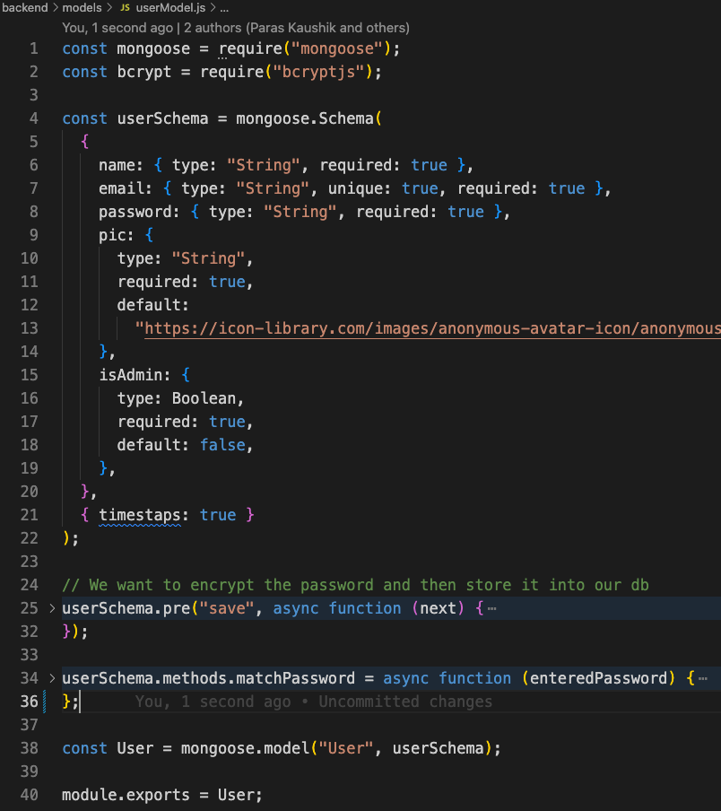

# Whatsapp Clone

## Functional Requirements
-  User should be able to Sign in with an profile image (BLOB storage needed)
-   User should be able to Login with the same credential thereafter (USER DATA PERSISTENT)
-   User should be able to search and view info of other users on the App
-   User should be able to initiate one-to-one chat with any other registered user
-  User should be able to create a group chat with other registered users
-  User should be able to remove other users from the group chat if he is the ADMIN
> -   **Realtime communication between Logged in user and any other user /users **
-  Realtime typing indicator is shown when the chat is active for user and somebody else is typing
-  Notification is shown for missed messages when chat is not active for any user
-  Messages are saved for all chats (CHAT DATA PERSISTENT)

## Non Functional Requirements
-  Highly available system
-  Realtime communication
-  Passwords should be encrypted and stored
-  JWT should be used as a stateless solution for authentication and authorization

## DEMOS
### ONE TO ONE CHAT

### GROUP CHAT

## Architecture

## Working
### Authentication and authorization
The connection handler checks for JWT token in the client request,if absent the client is not loggedIn , this service exposes sing-in with image upload and login apis , and also a protected api for searching other registered users
### How the messages are sent (Socket connection discovery and initiating one to one and Group Chats)

- When one user selects another user from the "Search Other Users" sidebar, a unique 'Chat' collection object is created that includes both users.There can only be one such chat object containing these two users. This object's ID is used to create a 'room' with the same ID. The first user can 'join' this room to establish a socket connection with the sever.

- When the second user comes online, they query for all the 'Chat' objects they are a part of. They also fetch the chat initiated by user1. Now, if the second user clicks on that chat, they will enter the same room as user1 because the unique room ID is provided by the unique 'Chat' ID.

- Now both users are in a same 'room' - same socket connection

- So a one to one chat can be thought of as a group chat with only two users , needless to say a group chat can be implemented same way by just adding more users to the users array and keeping a flag for `isGroupChat`

### Storing High Throughput Messages
If chat messages are stored synchronously in the database, their extremely high throughput will overwhelm the database and it will also introduce latency in the insertion process , so messages are dumped by the connection handler into a distributed message queue (rabbitMQ) , this service can then also be used as a querying service for all persistent data
## API'S
| API ENDPOINT  | TYPE  | ACCESS  | Description                  |
|---------------|-------|---------|------------------------------|
| /api/user/    | POST  | Public  | Register/SignIn new user    |
| /api/user/login| POST  | Public  | Auth the user    |
| /api/user?search=paras    | GET  | Protected  | Get or Search all users by name or email matching with the search query  |
| /api/chat/|  POST | Protected  |  Create or fetch One to One Chat,a userId is sent in the body which belongs to the other user chat is initiated to by the logged-in user ,if a chat exists with the users array containing both the logged-in user ID and the other id , that chat already exists , else we create the chat   |
| /api/chat/group| POST  | Protected  |   Create New Group Chat, a list of users ids and group name is sent in the body, the logged-in user becomes the groupAdmin  |
| /api/chat/|  GET |  Protected |    Fetch all chats for the logged-in user |
| /api/chat/rename|  PUT |  Protected |    Rename Group Chat |
| /api/chat/groupadd|  PUT |  Protected |   Add user to Group  |
| /api/chat/groupremove|  PUT | Protected  |   Remove user from Group  |
| /api/Message/    | POST  | Protected  | Create New Message and also set it as lastMessage of the corresponding chat    |
| /api/Message/:chatId    | GET  | Protected  | Get all Messages for a particular chat ID  |

<!-- ## Models -->
<!-- 
 -->
